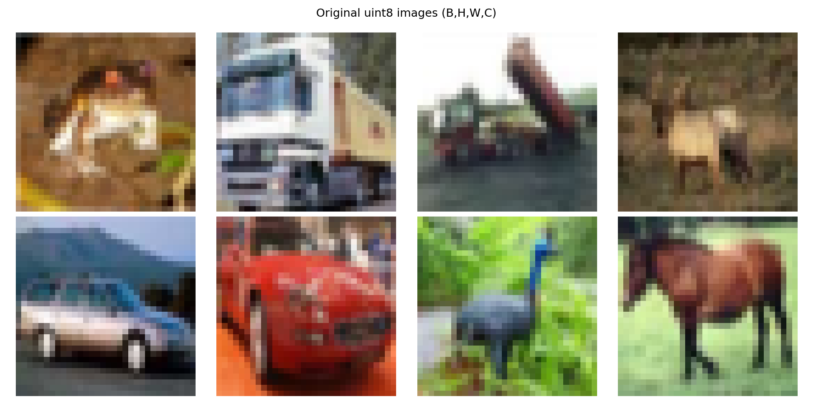
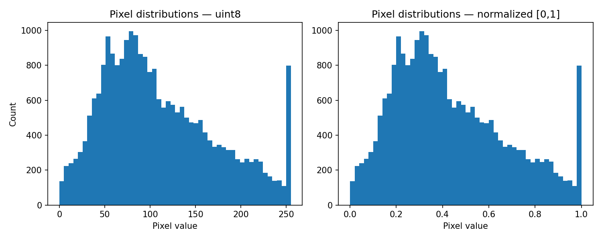
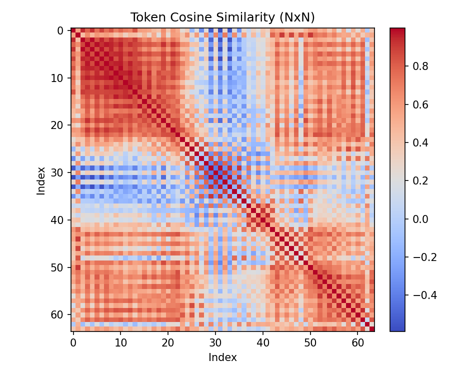
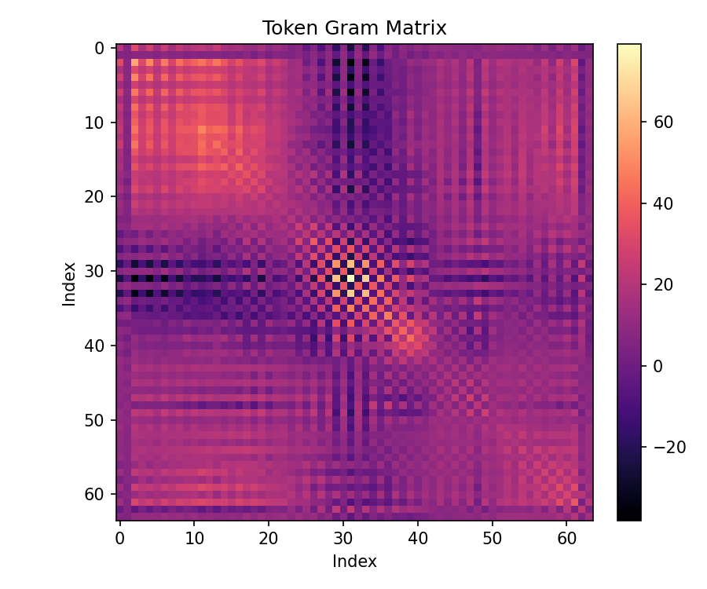

# Stage 00 — NumPy Basics & Tensor Intuition

## Goal
Build intuition for:
- arrays as tensors
- shapes and broadcasting
- basic linear algebra used throughout CV

This stage ensures all later stages have a shared mental model.

---

## What You Will Create in This Stage

By the end of Stage 00, you should have:

### 1) A tiny “tensor lab” module (core utilities)
A small set of reusable utilities and demos for:
- shape manipulation and layout transforms
- broadcasting patterns and common bugs
- vectorization patterns vs loops
- dtype pitfalls and safe normalization/clipping
- masking / indexing primitives (boolean masks, gather)
- numerical stability patterns (eps usage, stable softmax)
- sanity-check helpers for shapes and numeric equivalence

### 2) A reproducible mini dataset loader (tiny + real)
A lightweight NumPy-only data loader for CIFAR-10:
- downloading + extracting
- iterating batches (streaming)
- loading a small sample batch for demos

Labels are optional for Stage 00 (we focus on tensors).

### 3) One stage `main.py` mini project
A runnable script that ties everything together:
- loads a small dataset batch
- runs a sequence of tensor transformations + demos
- prints shape traces + key stats
- produces simple visualizations

---

## Concepts Covered
- Array shapes and axes
- Broadcasting rules (+ keepdims)
- Vectorization vs loops
- Dtype and numerical precision
- Layout conventions (NHWC vs NCHW)
- Masking and indexing primitives
- Numerical stability basics (eps, stable softmax)
- Reproducibility + sanity checks
- Basic linear algebra operations used throughout CV

---

## Implementation Checklist

### A) Tensor & Shape Fundamentals
- [ ] Create arrays with explicit shapes (`(H, W)`, `(H, W, C)`, `(N, D)`)
- [ ] Practice indexing and slicing across axes
- [ ] Use `reshape`, `transpose`, `swapaxes`, and `expand_dims` intentionally
- [ ] Implement `assert_shape(x, expected)` for sanity checks
- [ ] Add shape comments at key transformations (docstring or inline)

### B) Broadcasting (Must Master)
- [ ] Demonstrate scalar + vector + matrix broadcasting with clear examples
- [ ] Show common broadcasting bugs (wrong axis) and fix with `reshape` or `keepdims=True`
- [ ] Demonstrate `keepdims=True` vs without and why it prevents shape bugs
- [ ] Implement examples like:
  - per-channel operations (mean/std normalization)
  - per-row / per-column operations

### C) Vectorization vs Loops
- [ ] Implement loop vs vectorized versions for:
  - mean and variance (per image)
  - per-pixel transforms (e.g., gamma correction)
  - pairwise distances (small scale) on token-like arrays `(N, D)`
- [ ] Verify equality between implementations (within tolerance)
- [ ] (Optional) Quick timing comparisons on small arrays (educational only)

### D) Dtype & Numerical Precision
- [ ] Demonstrate uint8 overflow pitfalls (addition/multiplication wraparound)
- [ ] Convert to float safely (`astype(np.float32)`), and explain why float32 is default later
- [ ] Show normalization and clipping patterns (`np.clip`)
- [ ] Demonstrate eps usage to avoid division-by-zero
- [ ] (Optional) Show float32 vs float64 accumulation differences (tiny demo)

### E) Layout Conventions (CV-Runtime Mental Model)
- [ ] Implement NHWC ↔ NCHW conversion demos
- [ ] Explain where each layout appears and why conventions matter
- [ ] (Optional) Check contiguity flags after transpose and when `copy()` is used

### F) Masking & Indexing Primitives (Future MAE / Attention Prep)
- [ ] Boolean masking on images (e.g., threshold or region selection)
- [ ] `np.where` conditional transforms
- [ ] Fancy indexing / gather from token arrays using index vectors
- [ ] Show how a mask changes shapes and why it matters later

### G) Numerical Stability Basics (Future Attention Prep)
- [ ] Implement stable softmax for vectors (subtract max)
- [ ] Implement stable softmax along an axis for matrices (e.g., `(B, N, N)` attention-like)
- [ ] Add small sanity checks: sums to 1, no NaNs, stable under large values

### H) Linear Algebra Building Blocks (CV-relevant)
- [ ] Dot products and matrix multiplication: `@`
- [ ] Vector norms and cosine similarity
- [ ] Gram matrix demo: `X @ X.T` on tokens `(N, D)` → `(N, N)`
- [ ] Outer products and rank-1 structure
- [ ] (Optional) Simple PCA intuition with SVD on tiny batches

### I) Reproducibility & Sanity Checks
- [ ] Ensure seeding yields deterministic results for your demos
- [ ] Add at least one regression-style check (expected value/shape)
- [ ] Keep `main.py` orchestrator-only; logic lives in ops/data/viz

---

## Mini Project — “Tensor Playground on Real Images”

**Purpose:** Use a small, real dataset to repeatedly practice the tensor operations
you will need later for:
- patchify / tokenization
- attention shape reasoning
- reconstruction / residual mental models
- detection & tracking tensor layouts

### Dataset Choice (Recommended): CIFAR-10
- Small real RGB images: `(32, 32, 3)`
- Easy to download and handle
- Perfect size for toy experiments

> You do NOT need labels for Stage 00; this is purely for tensor practice.

---

## Mini Project Outputs (What `main.py` should do)

Your `main.py` should:

### 1) Load a batch of images
- Load `B` images as:
  - `images_uint8: (B, 32, 32, 3)`

### 2) Print “shape traces”
After every transformation, print:
- tensor name
- shape
- dtype
- min/max/mean

### 3) Demonstrate core transformations
- dtype conversion `uint8 -> float32`
- scaling to `[0, 1]`
- dataset-level per-channel mean/std (computed by streaming)
- apply dataset normalization to the batch
- reshape:
  - flatten: `(B, H*W*C)`
  - tokens (toy reshape): `(B, N, D)`
- broadcasting:
  - subtract per-channel mean (broadcast across H,W)

### 4) Run the demo modules
- vectorization demos (mean/var, gamma, pairwise distances)
- dtype precision demos (overflow, clipping)
- layout demos (NHWC/NCHW)
- masking demos (boolean mask, np.where, gather)
- stable softmax demos
- linear algebra demos (gram, cosine similarity)

### 5) Create visualizations (minimum set)
- [ ] Show a grid of original images
- [ ] Show a grid after normalization (visualized as uint8 for display)
- [ ] Show a histogram of pixel values before/after normalization

### 6) Validate correctness
- [ ] Assert expected shapes at key boundaries
- [ ] Verify loop vs vectorized results match (within tolerance)
- [ ] Softmax sanity: sums to 1, stable under large inputs


---

## Suggested Files to Create (Stage 00)

Keep this stage simple but structured:

- `src/main.py`
- `src/ops/tensor_basics.py`
  - shape helpers, reshape patterns, broadcasting demos
- `src/ops/vectorization.py`
  - loop vs vectorized implementations + checks
- `src/ops/dtype_and_norm.py`
  - uint8 pitfalls, normalization helpers
- `src/data/cifar10.py` (or `mnist.py`)
  - tiny downloader/loader (NumPy-only usage)
- `src/viz/plots.py`
  - image grids, histograms

---

## Example Outputs & Visualizations

Running `main.py` produces a set of concrete visual artifacts under:

```
00_numpy_basics/outputs/
```

These plots are intentionally simple and diagnostic — their purpose is to
**build intuition**, not aesthetics.

---

### Image Grids

**Original CIFAR-10 images (uint8, NHWC)**
Shows raw pixel values before any processing.



**Normalized images (visualized back to uint8)**
Images after float conversion and dataset-level normalization
(rescaled only for display).


These help verify:
- correct dtype handling
- correct per-channel normalization
- no unintended clipping or color distortion

---

### Pixel Distribution Diagnostics

**Pixel histogram before vs after normalization**



This plot demonstrates:
- uint8 → float scaling
- how normalization recenters and rescales distributions
- why normalization is essential before any linear algebra

---

### Token & Linear Algebra Visualizations

**Token cosine similarity matrix**



This heatmap shows cosine similarity between token vectors `(N × D)`:

- diagonal ≈ 1.0 (self-similarity)
- off-diagonal structure reveals redundancy and correlation
- this is exactly what attention scores *conceptually* measure later

---

**Token Gram matrix**



This matrix visualizes raw dot-product similarity:

- magnitude-sensitive
- highlights scale vs direction differences
- prepares intuition for `Q @ Kᵀ` in attention

---

### Why These Visualizations Matter

These plots are not “nice-to-have” — they directly support later stages:

| Visualization | Future relevance |
|---------------|------------------|
| Image grids | Debugging preprocessing pipelines |
| Histograms | Diagnosing normalization bugs |
| Cosine similarity | Attention, retrieval, clustering |
| Gram matrix | Linear algebra intuition, kernels |
| Masked tokens | MAE, sparse attention |

If these plots look wrong, **later models will fail silently**.

---

### Reproducibility Note

All plots are deterministic given the fixed seed in `Config`.
Re-running `main.py` should reproduce identical images and statistics.

---
## Key Notes
- Shapes matter more than values.
- Prefer explicit reshaping over implicit magic.
- Always reason about `(H, W, C)` vs `(N, D)` vs `(B, N, D)`.
- If you can’t explain a broadcasting operation, rewrite it with explicit reshape/keepdims.

---

## Reflection (Write this after completing Stage 00)
Answer in your own words:
- What did I misunderstand about shapes before this stage?
- Which broadcasting bug surprised me the most?
- What shape transformations show up everywhere in later CV pipelines?
- What conventions will I enforce in future stages to avoid confusion?
